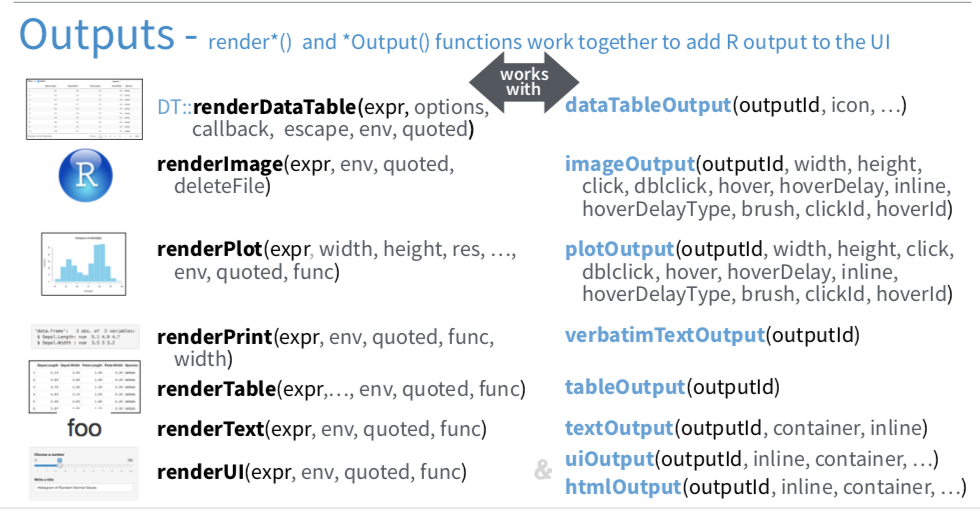

Introduction to Shiny
=====================

**Software carpentry R workshop - Imperial College 2019**  
Examples and solutions can be found in
<https://github.com/anatmela/shiny-intro-workshop>  
 

R shiny
-------

Shiny apps allow us to create interactive visualisations and dashboards,
allowing flexibility and interactivity for your data analysis. Note:
successful installation of `shiny` app is required. You can test to see
that it has installed correctly by running `library(shiny)` - if
installed correctly it will not return an error message.

Create a new app
----------------

In R studio: File -&gt; Open File -&gt; Shiny Web app Select a name for
your app file and the location into which it will be saved. Select the
option of creating two files. R studio will create a new folder in the
location selected and will place two .R files into it:

1.  ui.R
2.  server.R

your shiny app will always contain at least these two parts. It is
possible in more complexed apps to include auxillary files.

Structure of a shiny app
------------------------

1.  UI - defines the layout of the app, the interaction with the user.
2.  Server - defines the app logic, contains the commands required to
    produce output

The shiny app UI
----------------

Create a new app, define a side and main panels

    # app 1 - UI

    library(shiny)

    # Define UI for application
    shinyUI(fluidPage(
      
      # title of app
      titlePanel("Intro app 1"),
      
      sidebarLayout(
        
        # Sidebar - providing input options to server 
        sidebarPanel("Sidebar panel"),
        
        # Main panel
        mainPanel("Main panel"), 
      
        position = "left"
      )
    ))

  For now, we will leave the server side just defined

    # app1 - server

    # Define server logic required to draw a histogram
    shinyServer(function(input, output) {
       
    })

The app can be launched using the 'Run App' button.

As you can see, in the sidebar layout, the UI contains two components -

1.  the side panel, which will normally contain the input options, set
    by using specific widgets,
2.  the main panel, which will normall contain the output provided by
    the server.

### more complex output

If more than out type of output is to be provided, the main panel can be
divided into several tabs. To do so, add a `tabsetPanel()` to the main
panel

    # app2 UI

        mainPanel("Main panel", 
                  tabsetPanel(
                    tabPanel("tab 1"),
                    tabPanel("tab 2"),
                    tabPanel("tab 3")
                  )
        )

html content (static or calculated) can be added to each of the
sections. For example, lets add some text to the side panel:

    # app2 UI

        # Sidebar - providing input options to server 
        sidebarPanel("Sidebar panel", 
                     h6("this is the side panel"))

The input from the user is captured using a variety of
[widgets](https://shiny.rstudio.com/gallery/widget-gallery.html),
depending on the type of values to be captured (numeric, dates, text,
logical etc).

for example, lets add a couple of widgets:

    # app3 UI

        sidebarPanel("Sidebar panel", 
                     p(), 
                     sliderInput("valchoice", 
                                 "Select value", 
                                 min = 100, 
                                 max = 500, 
                                 value = 200), 
                     
                     selectInput("colourchoice", 
                                 "Select colour", 
                                 choices = c("black", "blue", 
                                             "green", "red"), 
                                 selected = "black")
                     )

Input choices are saved into a list object called `input`.

### Challenge 1

Create a shiny app with a sidebar layout. The app should contain three
tabs: "Plot", "data example" and "Summary". The app should allow the
user to select a continent from the continents listed in the gapminder
data using a drop down list. You will need to add `library(gapminder)`
to include the data in the app.

The shiny app server
--------------------

We can add to the different output types, for example in the main panel.
Output can include plots of various kinds, data tables, and other html
objects.

    # app3 UI
                  tabsetPanel(
                    tabPanel("plot", 
                             plotOutput("plot1")),
                    tabPanel("text", 
                             verbatimTextOutput("text1")),
                    tabPanel("table", 
                             tableOutput("table"))
                  )

In order to produce objects for output, we need to produce them in the
server script. Objects created in the server are saved into an output
list object. Each `Output` function in the UI script, has a
corresponding `Render` function in the server.

    # app3 server

    library(tidyverse)

    shinyServer(function(input, output) {
      
      output$plot1 <- renderPlot({
        ggplot() + 
          geom_point(aes(x = 1:100, y = 1:100))
      }) 
      
      output$text1 <- renderText({
        print("This is a text")
        })
      
      output$table <- renderTable({
        head(mtcars)
      })
      
    })

The variables from the input can be used to inform the output by using
the `input$` object

    # app4 server

    shinyServer(function(input, output) {
      
      output$plot1 <- renderPlot({
        val = input$valchoice
        
        ggplot() + 
          geom_point(aes(x = rnorm(val), y = 1:val))
      }) 
      
      output$text1 <- renderPrint({
        print(input$colourchoice)
        })
      
      output$table <- renderTable({
        head(mtcars)
      })
      
    })

### Challenge 2

modify app4, so that the colour of the points is set by the colour
variable set in the input.

Challenge 3
-----------

Create a shiny app based on the gapminder data - app should contain
three tabs:

1.  displays a plot of Life expentancy as a function of GDP
2.  displays a table with an example of the data
3.  displays the text generated by the `Summary` function

The app should allow the user to choose a subset the data according to
the following:

-   the continent (using a drop down list)
-   the range of years (using a slider)
-   the minimum population in the countries

Extra - allow the user to change between continous or log scale on the x
axis.

for further reading and reference
---------------------------------

-   R studio cheet sheets

-   Shiny widgets for data input
    <https://shiny.rstudio.com/gallery/widget-gallery.html>

-   Function reference <http://shiny.rstudio.com/reference/shiny/1.1.0/>

-   Additional information on alternative layouts -
    <http://shiny.rstudio.com/articles/layout-guide.html>

-   Examples of shiny apps on the R Studio Shiny site
    <https://shiny.rstudio.com/gallery/>
