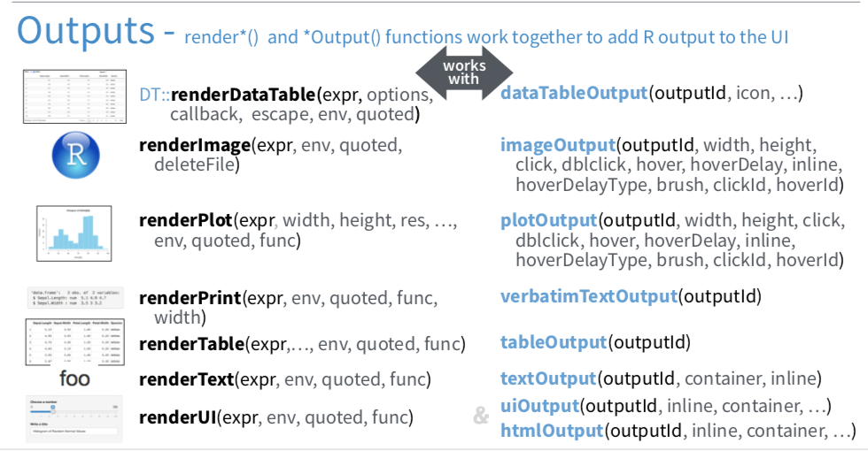

```{r setup, include=FALSE}
knitr::opts_chunk$set(echo = TRUE)
knitr::opts_chunk$set(eval = FALSE)
```
## R shiny
Shiny apps allow us to create interactive visualisations and dashboards, allowing 
flexibility and interactivity for your data analysis. 
Note: successful installation of ``shiny`` app is required. You can test to see that it has installed correctly by running ``library(shiny)`` - if installed correctly it will not return an error message.

## Create a new app 
In R studio: 
File -> Open File -> Shiny Web app
Select a name for your app file and the location into which it will be saved. Select the option of creating two files. 
R studio will create a new folder in the location selected and will place two .R files into it:  

1. ui.R
2. server.R

your shiny app will always contain at least these two parts. It is possible in more complexed apps to include auxillary files. 

## Structure of a shiny app 

1. UI - defines the layout of the app, the interaction with the user.
2. Server - defines the app logic, contains the commands required to produce output

## The shiny app UI
Create a new app, define a side and main panels

```{r}
# app 1 - UI

library(shiny)

# Define UI for application
shinyUI(fluidPage(
  
  # title of app
  titlePanel("Intro app 1"),
  
  sidebarLayout(
    
    # Sidebar - providing input options to server 
    sidebarPanel("Sidebar panel"),
    
    # Main panel
    mainPanel("Main panel"), 
  
    position = "left"
  )
))

```
<br>
For now, we will leave the server side just defined
```{r}
# app1 - server

# Define server logic required to draw a histogram
shinyServer(function(input, output) {
   
})
```
The app can be launched using the 'Run App' button. 

As you can see, in the sidebar layout, the UI contains two components - 

1. the side panel, which will normally contain the input options, set by using 
specific widgets, 
2. the main panel, which will normall contain the output provided by the server. 

### more complex output

If more than out type of output is to be provided, the main panel can be divided 
into several tabs. 
To do so, add a ``tabsetPanel()`` to the main panel
```{r}
# app2 UI

    mainPanel("Main panel", 
              tabsetPanel(
                tabPanel("tab 1"),
                tabPanel("tab 2"),
                tabPanel("tab 3")
              )
    )
```

html content (static or calculated) can be added to each of the sections.  For example, lets add some text to the side panel: 
```{r}
# app2 UI

    # Sidebar - providing input options to server 
    sidebarPanel("Sidebar panel", 
                 h6("this is the side panel"))
```

The input from the user is captured using a variety of [widgets](https://shiny.rstudio.com/gallery/widget-gallery.html), depending on the type of values to be captured (numeric, dates, text, logical etc).  

for example, lets add a couple of widgets: 
```{r}
# app3 UI

    sidebarPanel("Sidebar panel", 
                 p(), 
                 sliderInput("valchoice", 
                             "Select value", 
                             min = 100, 
                             max = 500, 
                             value = 200), 
                 
                 selectInput("colourchoice", 
                             "Select colour", 
                             choices = c("black", "blue", 
                                         "green", "red"), 
                             selected = "black")
                 )
```

Input choices are saved into a list object called ``input``. 

### Challenge 1
Create a shiny app with a sidebar layout.  The app should contain three tabs: "Plot", "data example" and "Summary". The app should allow the user to select a continent from the continents listed in the gapminder data using a drop down list. You will need to add ``library(gapminder)`` to include the data in the app. 

## The shiny app server
We can add to the different output types, for example in the main panel. Output can include plots of various kinds, data tables, and other html objects. 

```{r}
# app3 UI
              tabsetPanel(
                tabPanel("plot", 
                         plotOutput("plot1")),
                tabPanel("text", 
                         verbatimTextOutput("text1")),
                tabPanel("table", 
                         tableOutput("table"))
              )
```

In order to produce objects for output, we need to produce them in the server script. Objects created in the server are saved into an output list object.  Each ``Output`` function in the UI script, has a corresponding ``Render`` function in the server.   



```{r}

# app3 server

library(tidyverse)

shinyServer(function(input, output) {
  
  output$plot1 <- renderPlot({
    ggplot() + 
      geom_point(aes(x = 1:100, y = 1:100))
  }) 
  
  output$text1 <- renderText({
    print("This is a text")
    })
  
  output$table <- renderTable({
    head(mtcars)
  })
  
})

```
The variables from the input can be used to inform the output by using the ``input$`` object

```{r}
# app4 server

shinyServer(function(input, output) {
  
  output$plot1 <- renderPlot({
    val = input$valchoice
    
    ggplot() + 
      geom_point(aes(x = rnorm(val), y = 1:val))
  }) 
  
  output$text1 <- renderPrint({
    print(input$colourchoice)
    })
  
  output$table <- renderTable({
    head(mtcars)
  })
  
})
```


### Challenge 2
modify app4, so that the colour of the points is set by the colour variable set in the input. 

## Challenge 3
Create a shiny app based on the gapminder data - 
app should contain three tabs: 

1. displays a plot of Life expentancy as a function of GDP 
2. displays a table with an example of the data
3. displays the text generated by the ``Summary`` function

The app should allow the user to choose a subset the data according to the following: 

 - the continent (using a drop down list)
 - the range of years (using a slider)
 - the minimum population in the countries

Extra - allow the user to change between continous or log scale on the x axis.


## for further reading and reference 
* R studio cheet sheets

* Shiny widgets for data input
https://shiny.rstudio.com/gallery/widget-gallery.html

* Function reference
http://shiny.rstudio.com/reference/shiny/1.1.0/

* Additional information on alternative layouts - 
http://shiny.rstudio.com/articles/layout-guide.html

* Examples of shiny apps on the R Studio Shiny site
 https://shiny.rstudio.com/gallery/